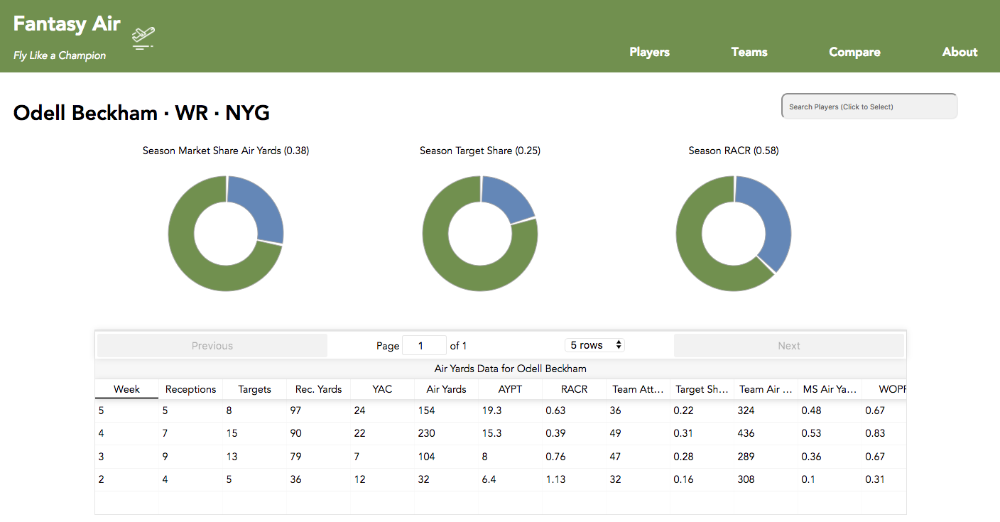

# Fantasy Air

Check it out for yourself, new to fantasy football? See the About section.
www.fantasyair.co

## Photos





## Technologies 

Fantasy Air was developed using React.js for the views and Ruby on Rails for serving the data. 

All data for Fantasy Air comes from www.airyards.com/2017/weeks. The API returns an array with an object
containing data for every player who received a target every week. 1 object per week per player. 

The data was seeded and served through Rails and consumed by a React.js build on the front end. 

Semiotics.js was used to render the player data graphs, and React-table.js was utilized to render the tables
for player and team data. 

## User Stories

**Casual Player**
As a casual player, I am looking for a site that will give me large visual representations of data so I can make more informed decisions on who to play! This football stuff is confusing! Just tell me what to do in a way I can understand! 

**Avid Player**
As an avid fantasy football player, I am looking for a site to give me unique statistics that will help me make decisions on players to add, trade, start/sit, and drop.
 
**Fantasy Fanatic**
As a fantasy football pro, I want a state of the art tool that will allow me to crunch the numbers any way I see fit. I want to be able to add players to my profile and compare them so I can see who is worth starting and who is droppable. 

## Approach 

Fantasy Air was born from an idea after a friend showed me the JSON dataset over drinks. He was actually giving me a hard time about my fantasy teams performance and said I should analyze the data and learn something to make my team better. 

From funny idea to actual app, Fantasy Air was designed with designs and users in mind. I branched out from the usual pen and paper wireframes and graduated to Sketch. Sketch is a great tool and without it Fantasy Air wouldn't have been possible. See wireframes below. 


From there I built out the back-end, or enough if it to get going on the front-end. Once the two parts were talking to each other I really built it out piece-meal thinking about what I would need from the back end and in what order I would need it to get and show the data. 

Since the API only serves weekly data for one player all aggregation had to be done on the back-end. This was GREAT using active record with a postgresql database in Rails. I found the commands intuitive and once I got the hang of them I could aggregate player stats for the season, team stats, dynamically query the full_name column of the Player table to return top 5 results, and more!

Lastly, once I had all of the data I wanted on the front-end I really focussed on data-visualizations and spent almost 2 full days working through Semiotic and React-table packages to show the data I wanted where and how I wanted it. If I could do it over again...not sure I would have used the Semiotics due to the difficulty in maniuplating SVGs in CSS. 

## Wish List 

If I had a little more time, and I probably will soon, I would have added historical data to the site. Prior year Air Yards data is available in the same format at ```www.airyards.com/${year}/weeks```. The main issue is that the players don't come with an id only an index that changes every time the data is sent from the API. So mapping a player to his historical stats would be a challenge. You could do it by full name, but some players have the same name. You could do it by full name and team, but some players switch teams between season. Would love to try and solve it soon. 

Integrate ESPN or Yahoo Fantasy oAuth. I'm not even sure this is possible for ESPN without "corporate sponsorship", but some of my favorite fantasy sites let you import your rosters from those sites. That way you can see player analysis for your entire team without having to manually imput your teams.


